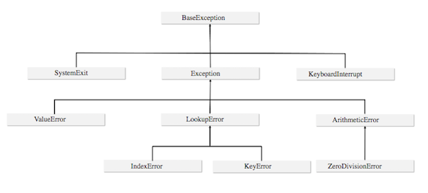

# Excepcions

### Introducció

Quan l'execució d'un programa falla, Python atura el programa i crea un tipus de dada anomenat **excepció**.
Aquesta excepció és llençada a l'espera d'un bloc de codi que s'encarregui de reconduir la situació i continuar l'execució
del programa, si l'excepció és capturada Python aturarà completament el programa.

Totes les excepcions tenen un nom concret que permet identificar-les i tractar-les correctament, per exemple:
`ValueError`, `ZeroDivisionError` o `IndexError`.

### Gestió d'excepcions: try, except

Els possibles errors que poden produir-se durant l'execució d'un programa es gestionen amb les paraules clau `try` i `except`:
 
* `try` s'utilitza per iniciar un bloc de codi susceptible de produir errors
* `except` forma un altre bloc de codi que conté una reacció adequada als possibles errors i serà executat només en el cas
 que es produeixi un error

Python intentarà executar les instruccions del bloc `try`:

* si tot va bé acabarà el bloc i continuarà per la primera instrucció després del bloc `except`
* si es produeix algun error l'execució passarà a la primera instrucció del bloc `except`  

```python
a = int(input())
b = int(input())
try:
    print(a/b)
except:
    print("Operació incorrecta!")
# continuació del codi
```

### Múltiples excepcions

Donat que un bloc de codi pot produir diferent tipus d'excepcions amb solucions també diferents,
sovint haurem de crear més d'un bloc `except` que capturi els diferents errors que es puguin produir.
En aquest cas, caldrà especificar el tipus d'error després de la paraula `except`.
 
 ```python
try:
    # Codi que pot produir errors
except ValueError:
    # Codi en cas que es produeixi una excepció ValueError
except ZeroDivisionError:
    # Codi en cas que es produeixi un excepció ZeroDivisionError
except:
    # Codi per a qualsevol altre tipus d'excepció
```

Per capturar més d'una excepció en un mateix bloc podem unir-les en una tupla:

```python
try:
    # Codi que pot produir errors
except (ValueError, ZeroDivisionError):
    # Codi en cas que es produeixi un excepció ValueError o ZeroDivisionError
except:
    # Codi per a qualsevol altre tipus d'excepció
```

### Jerarquia de les excepcions

Python defineix 63 tipus d'excepcions organitzades jeràrquicament.
Algunes d'aquestes excepcions són més generals i inclouen excepcions més específiques.



Quan disposem de més d'un bloc `except`, aquests s'examinen en el mateix ordre en què es troben escrits al codi.
Això vol dir que, en cas d'error, el programa saltarà al primer bloc `except` amb una excepció igual a la llençada o que la contingui.
Per tant, quan escrivim els blocs d'excepcions, cal situar les més específiques primer i les més generals a continuació.
En aquest sentit, el cas més general `except:` sempre haurà de ser l'últim.

 ```python
try:
    # Codi que pot produir errors
except ZeroDivisionError:
    # Codi en cas que es produeixi una excepció ZeroDivisionError
except ArithmeticError:
    # Codi en cas que es produeixi un excepció de tipus aritmètic
except:
    # Codi per a qualsevol altre tipus d'excepció
```

### Propagació d'excepcions

Una excepció pot propagar-se d'una funció al codi que l'ha cridat.
La captura de les excepcions pot fer-se tant a dins d'una funció com en el codi que l'està invocant, però si no es captura provocarà la finalització del programa.
```python
# Captura dins d'una funció
def inversa(n):
    resultat = None
    try:
        resultat = 1/n
    except:
        print("Problema efectuant la operació")
    return resultat

inversa(0)
```

```python
# Captura fora de la funció
def inversa(n):
    return 1/n

try:
    inversa(0)
except:
    print("Problema efectuant la operació")
```

### Llençament d'excepcions

La instrucció `raise` permet llençar excepcions com si s'hagués produït un problema.
Això permet comprovar el comportament del codi davant d'una excepció i, més endavant, 
crear les pròpies excepcions i llençar-les quan sigui necessari.

```python
def problema():
    raise ZeroDivisionError

try:
    problema()
except ArithmeticError:
    print("Problema")
```

Quan la instrucció `raise` s'utilitza dins d'un bloc `except` sense especificar cap tipus d'excepció es tornarà a llençar
l'excepció anterior. En aquest cas caldrà capturar-la en el codi que l'hagi invocat.
```python
def inversa(n):
    try:
        return 1/n
    except:
        print("Primer llençament")
        raise

try:
    inversa(0)
except:
    print("Segon llençament")
```

### Avaluació d'expressions: assert

La paraula clau `assert` permet avaluar una expressió i llençar una excepció en cas de que no sigui correcta.
Aquesta paraula se situa davant d'una expressió, si el resultat és `True` no fa res, però si el resultat és `False` 
llença una excepció de tipus `AssertionError`. 

```python
import math
x = float(input())
assert x>=0.
y = math.sqrt(x)
```

### Excepcions útils

* `BaseException` - L'excepció més general, inclou a totes les altres.
    * `AssertionError` - Es llença quan l'expressió d'una sentència `assert` és avaluada com a `False`, `None`, 0 o "".
    * `KeyboardInterrupt` - Es llença quan un usuari atura l'execució del programa manualment (`Ctrl-C`)
    * `Exception` - Excepcions causades per errors de funcionament del codi
        * `ArithmeticError` - Excepcions causades per operacions aritmètiques
            * `OverflowError` - Es llença quan una operació produeix un nombre excessivament gran per ser emmagatzemat
        * `LookupError` - Excepcions causades per errors que resulten de referències invàlides
            * `IndexError` - Es llença quan s'intenta accedir a un element d'una llista inexistent
            * `KeyError` - Es llença quan s'intenta accedir a una clau inexistent d'un diccionari
        * `MemoryError` - Es llença quan una operació no es pot completar per falta de memòria
        * `StandardError`
            * `ImportError` - Es llença quan falla una importació


